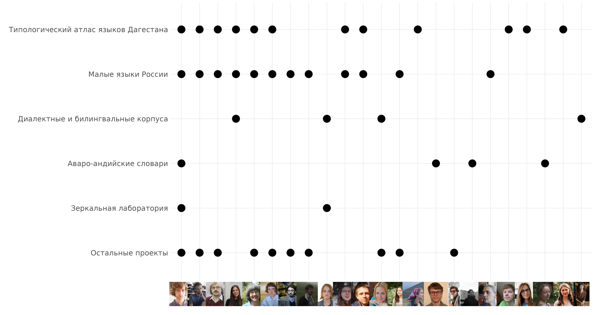
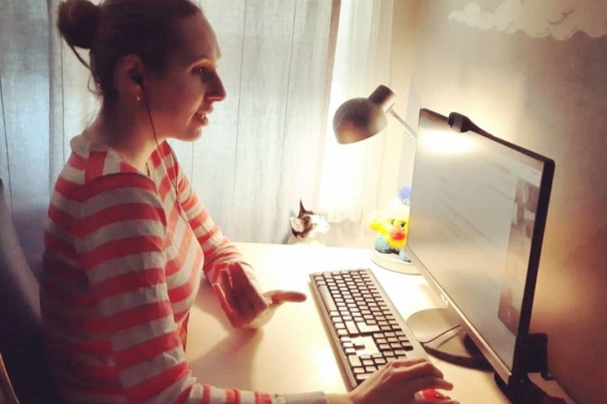

```{r, include=FALSE}
knitr::opts_chunk$set(echo = FALSE, warning = FALSE, message = FALSE, dev='cairo_pdf')
library(tidyverse)
theme_set(theme_minimal()+theme(legend.position = "bottom", text = element_text(size = 26)))
```

## О лаборатории

* Открыта в 2017 году

```{r, out.width="40%", fig.cap="Н. Р. Добрушина и Дж. Николс", fig.show='hold', fig.align='center'}
knitr::include_graphics("images/01_dobrushina.jpg")
knitr::include_graphics("images/02_nichols.jpg")
```

Оба исследователя специализируются на славянских языках и языках Кавказа, а также лингвистической типологии

* C июля 2022 новый заведующий

## Миссия

Исследование механизмов конвергентных процессов в истории языка, то есть языковых ситуаций, при которых контакт между носителями разных языков ведет к появлению у этих языков общих черт. В лаборатории разрабатываются инструменты для выявления результатов таких процессов по данным электронных корпусов устной речи и создаются каталоги таких явлений на материале малых языков России.

## Состав

```{r}
read_csv("data/n_people.csv") %>% 
  pivot_longer(names_to = "var", values_to = "value", n_people:phd) %>% 
  mutate(var = case_when(var == "n_people" ~ "всего сотрудников", 
                         var == "phd" ~ "канд. наук/PhD")) %>% 
  ggplot(aes(year, value, label = value, group = var, fill = var))+
  geom_line()+
  geom_point(shape = 22, size = 7)+
  geom_label(size = 10, show.legend = FALSE)+
  scale_fill_manual(values = c("lightblue", "darkseagreen3"))+
  labs(x = "", y = "", fill = "", color = "")
```

## Основные проекты

```{r, out.width="110%"}

```

## Типологический атлас языков Дагестана

- 48 глав, описывающих грамматические особенности языков Дагестана, каждая глава
  - прошла рецензирование
  - содержит набор стандартизированных динамических карт

```{r, out.width="80%", fig.align='center'}
knitr::include_graphics("images/04_tald.png")
```

## Диалектные устные корпуса русского языка

- 15 диалектных устных корпусов русского языка
- 7 устных корпусов билингвального русского

```{r, out.width="100%", fig.align='center'}
knitr::include_graphics("images/05_corpus.png")
```

## 105 семинаров за 2020--2022

- Еженедельные англоязычные семинары, вторник 16:00

```{r, out.width="90%", fig.align='center'}
knitr::include_graphics("images/06_seminar.jpg")
```

## Школы, круглые столы, экспедиции

- Онлайн школа по Нахско-дагестанским языкам (на английском языке, открытая, онлайн), 24 лекции, более 100 участников, почти 8 тысяч просмотров
- Онлайн курс по азербайджанскому Мурада Сулейманова (École Pratique des Haute Études, 2020)
- Международный воркшоп “Emerging Topics in Typology” (между 25 октября и 22
ноября 2021, онлайн)
- Воркшоп “Spatial and social separation of speech communities and language
change” на 55-ом съезде европейского лингвистического общества (24–27 августа 2022,
Бухарест)
- Два выезда российского общества полевых лингвистов (март и октябрь 2022)
- Около 20 экспедиций по исследованию малых языков и сбору данных в Дагестан, Адыгею, Карачаево-Черкесию, Кабардино-Балкарию, Чукотку и Сахалин \pause
- Планируем в следующем году устроить школу по корпусным исследованиям

## Защиты диссертаций

- Состоялась одна защита (планировалось 3):
  - Предзащита А. Н. Закировой назначена на 19 декабря 2022
  - А. В. Яковлева защитилась 25 октября 2021 
  
```{r, out.width="75%", fig.align='center'}

```

\pause

- В данный момент в лаборатории работают еще четыре аспиранта

## Привлеченные средства

- 17.5 млн (планировалось 15 млн)
- 2018 – 2020 Грант РФФИ (18-012-00852А) "Морфосинтаксис андийского языка: опыт внутригенетической типологии"
- 2018 – 2021 Грант РНФ (18-78-10128) "Когда глагол не глагол: нефинитные конструкции в языках России"
- 2019 – 2022 Грант РНФ (19-78-10139) "Аргументная структура, залог и актантная деривация в языках Западной Сибири"
- Подана заявка на новый грант РНФ совместно со Школой лингвистики "Лингвистические маркеры социальных изменений"

## Публикации

- 32 публикации (планировалось 24)
- Включая 15 WoS Q1-Q2 (планировалось 8)

## Будущие планы

- Продолжать и поддерживать существующие проекты
  - исследование и документация малых языков России
  - исследование вариативности на материале имеющихся устных корпусов
  - типологические исследования
- Совместная работа с региональными университетами по созданию новых устных корпусов русского языка
  - уже идет работа с Южным Федеральным Университетом в рамках зеркальной лаборатории
  - контакты с Иркутским государственным университетом, вышкинским кампусом в Санкт Петербурге (заявка на межкампусное взаимодействие)
- Переориентация имеющихся ресурсов на конкретные продукты для малых языков
  - распознавание речи
  - материалы и словари малых языков
  - морфологические парсеры, спеллчекеры, предиктивный набор

## {}

\LARGE Спасибо за внимание!
