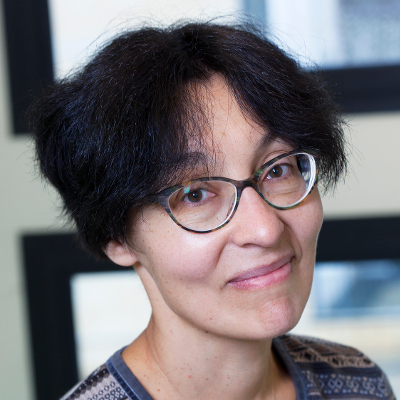
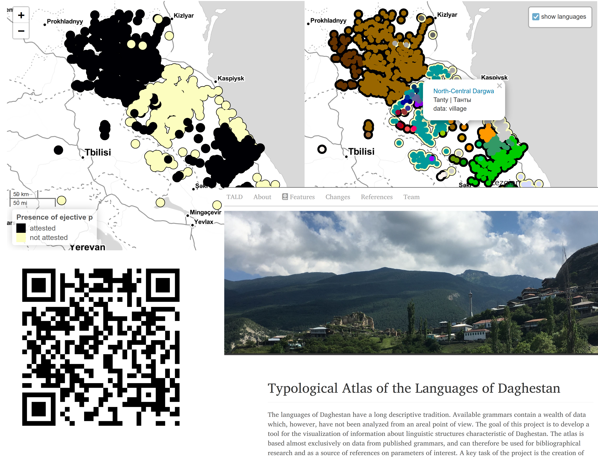
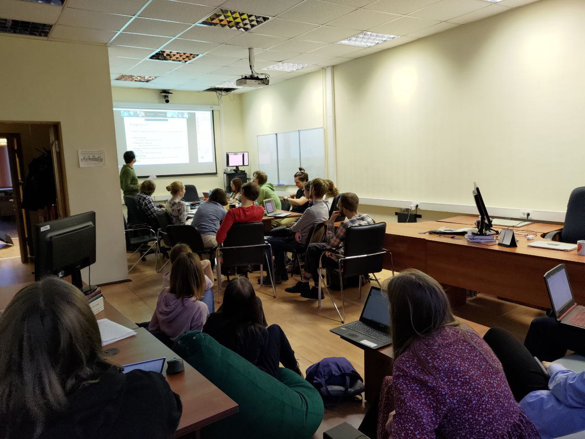

```{r, include=FALSE}
knitr::opts_chunk$set(echo = FALSE, warning = FALSE, message = FALSE, dev='cairo_pdf')
library(tidyverse)
theme_set(theme_minimal()+theme(legend.position = "bottom", text = element_text(size = 26)))
```

## О лаборатории

* Открыта в 2017 году

```{r, out.width="40%", fig.cap="Н. Р. Добрушина и Дж. Николс", fig.show='hold', fig.align='center'}

knitr::include_graphics("images/02_nichols.jpg")
```

Оба исследователя специализируются на славянских языках и языках Кавказа, а также лингвистической типологии

* C 2022 новый заведующий

## Миссия

Исследование механизмов конвергентных процессов в истории языка, то есть языковых ситуаций, при которых контакт между носителями разных языков ведет к появлению у этих языков общих черт. В лаборатории разрабатываются инструменты для выявления результатов таких процессов по данным электронных корпусов устной речи и создаются каталоги таких явлений на материале малых языков России.

## Состав

```{r}
read_csv("data/n_people.csv") %>% 
  pivot_longer(names_to = "var", values_to = "value", n_people:phd) %>% 
  mutate(var = ifelse(var == "n_people", "всего сотрудников", "канд. наук/PhD")) %>% 
  ggplot(aes(year, value, label = value, group = var, fill = var))+
  geom_line()+
  geom_point(shape = 22, size = 7)+
  geom_label(size = 10, show.legend = FALSE)+
  scale_fill_manual(values = c("lightblue", "darkseagreen3"))+
  labs(x = "", y = "", fill = "", color = "")
```

## Основные проекты

```{r, out.width="110%"}
knitr::include_graphics("images/03_projects.png")
```

## Типологический атлас Дагестана

- 48 глав, описывающих грамматические особенности языков Дагестана, каждая глава
  - прошла рецензирование
  - содержит набор стандартизированных динамических карт

```{r, out.width="80%", fig.align='center'}

```

## Диалектные устные корпуса русского языка

- 15 диалектных устных корпусов русского языка
- 7 устных корпусов билингвального русского

```{r, out.width="100%", fig.align='center'}
knitr::include_graphics("images/05_corpus.png")
```

## Семинары

- Еженедельные англоязычные семинары, вторник 16:00

```{r, out.width="90%", fig.align='center'}

```

## Школы, круглые столы, экспедиции

- Онлайн школа по Нахско-дагестанским языкам (на английском языке, открытая, онлайн), 24 лекции
- Международный воркшоп “Emerging Topics in Typology” (между 25 октября и 22
ноября 2021, онлайн)
- Воркшоп “Spatial and social separation of speech communities and language
change” на 55-ом съезде европейского лингвистического общества (24–27 августа 2022,
Бухарест)
- Два выезда российского общества полевых лингвистов (март и октябрь 2022)
- Около 20 экспедиций по исследованию малых языков и сбору данных

## Защиты

## Привлеченные средства

## Публикации

## Будущие планы

- Продолжать существующие проекты
- Поддерживать существующие ресурсы
- На основе существующих корпусов

## {}

\LARGE Спасибо за внимание!
